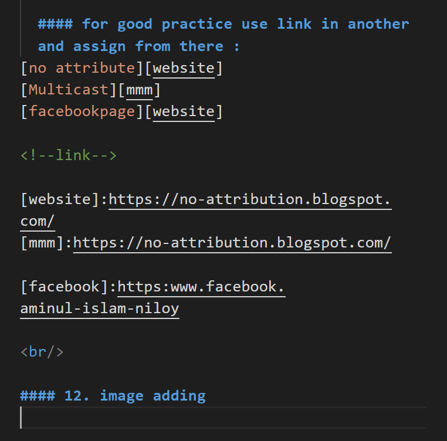
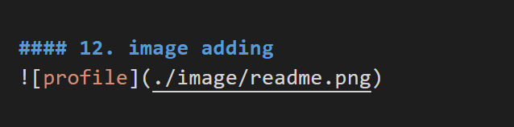
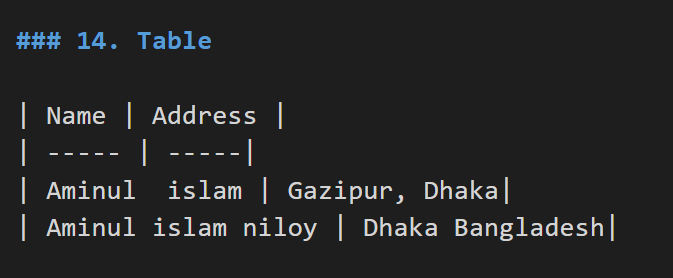

<!--markdown tutorial-->
Author : Aminul islam Niloy <br/>
___
# Git and Github

## This repo is about basic and advance oparation on git and github

___
<p> In this section you can learn how to add README.md file and edit inside md file. I think it's very easy and important for  developer </p>

<br/>


_operatin is stated from here :_

<i>1. you can also use <- i> for italic text and  style</i>

__2. if you use double underscore in start and last  then it will be bold__

~~3. if you want to delete and text you can use ~ 2 times is start and last~~
##### 4. is work like h1 or ....h6 and yo have to use in start position on sentance and make sure leading space
___

5 if you want need break line you can use <-br/> and also you can use two space 

6 if you want to use plain line then just type underscore 3 time _ _ _ without space

`7. Happy Coding` if you want inline use ` in start and end position

```
<h1>8. if you want t wite multiple line  code then just type ` is three time without space and make sure position is start and last & also use enter </h1>

<body> this is body </body>

<p> you assume that it's like html and you're correct ! </p>

```

```html
<h3> this is h3 tag </h3>
<i> _is using for italic_ </i>
<p> used for peragraph</p>

```

```javascript
console.log("are you still reading? )
console.log("Good !")  

# in this section you understood that after ` 3 time if you use language type it will be look like those language
```
<br/>

#### 8. For order list : 

8. this is 8 number rules or operation  
    8.1 this is 8.1  
            8.11 is inside 8  
            8.111   
    9  is not working but why? 

<br/>

#### 9. Unorder list

- list 1
   - list 1.1
   - list 1.2
- list 2
- list 3

<br/>

#### 10. Task list

- [x] list 1
- [x] list 2
- [x] list 3
- [] list 4

#### 11. link use:

https://no-attribution.blogspot.com/

  _use can also use_  
  [no attribute](https://no-attribution.blogspot.com/) by using [ insite title ] title and (link) insde  
<br/>


  #### for good practice use link in another and assign from there : 
[no attribute][website]  
[Multicast][mmm]  
[facebookpage][website]

<!--link-->

[website]:https://no-attribution.blogspot.com/
[mmm]:https://no-attribution.blogspot.com/

[facebook]:https:www.facebook.aminul-islam-niloy

<br/>  

#### 12. image adding 


#### if you want to add image you can follow this :
! then [alt text] then (path)

example: 


also you can use 

  
  <br/>  

### 13. emoji using 

directly use emoji  😊❤️👌😁

<br/>  

### 14. Table 

| Name | Address |
| ----- | -----|
| Aminul  islam | Gazipur, Dhaka|
| Aminul islam niloy | Dhaka Bangladesh|

#### example : 




  


